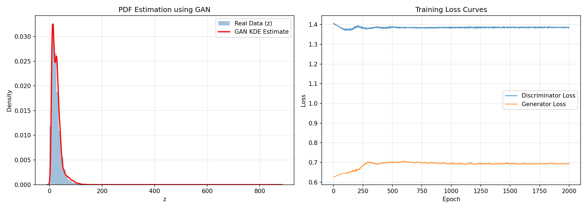
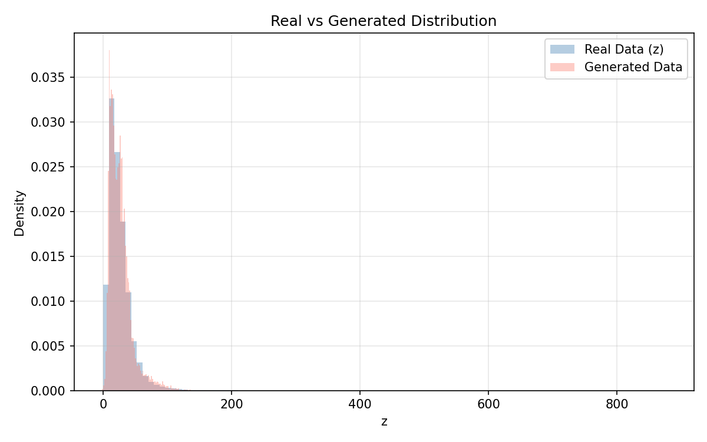

**Name:** Keshav Peshawaria
**Roll No:** 102303502

# 🚀 Learning PDF using GAN

Hey there! Welcome to my Advanced Mathematics assignment. The goal of this project was pretty interesting: instead of just assuming a probability distribution has a standard shape (like a Bell curve or an exponential distribution), what if we could use a Generative Adversarial Network (GAN) to *learn* the shape of the distribution straight from the data?

That's exactly what this repo does. We take some real-world air quality data, apply a custom mathematical transformation to it (based on my roll number), and train a GAN to figure out the underlying probability density function (PDF). No formulas assumed!

---

## 📊 The Data

For this experiment, I used the **India Air Quality Data** (specifically focusing on Nitrogen Dioxide, or `no2` concentrations in µg/m³). 
You can grab the original dataset [here](https://www.kaggle.com/datasets/shrutibhargava94/india-air-quality-data).

After cleaning up the missing values, I ended up with **419,509** valid data points.

---

## 🛠️ How It Works (The Methodology)

### 1. Custom Transformation
To make things a bit more challenging, I didn't just feed the raw NOâ‚‚ data into the GAN. I transformed it using a unique sinusoidal function derived from my roll number (`102303502`). 

Here's the math behind it:
- **`r`** = 102303502
- **`a_r`** = 0.5 × (r mod 7) = **0.0**
- **`b_r`** = 0.3 × (r mod 5 + 1) = **0.9**

So, every original data point `x` gets shifted like this:
> **z = x + 0.0 × sin(0.9 × x)**

This little sine wave perturbation adds some neat wobbles to the data's shape without completely destroying the original distribution.

### 2. Standardization
Neural networks usually prefer nicely scaled inputs. So, before training, I standardized the `z` values to have a mean of 0 and a standard deviation of 1. It just keeps the GAN training stable!

### 3. The GAN Setup
I kept the neural networks fairly small and simple since this is a 1D problem:
- **The Generator:** Takes in some random noise (from a normal distribution) and passes it through a couple of hidden layers (sizes 16 and 32) using LeakyReLU activations. It spits out a single fake `z` value.
- **The Discriminator:** Looks at a `z` value and tries to guess if it's real (from our dataset) or fake (from the generator). It has hidden layers of 32 and 16, ending in a Sigmoid activation to give a probability score.

### 4. Training Process
I trained the GAN for **2000 epochs** using the Adam optimizer (learning rate: 0.0002). 
The generator and discriminator battle it out: the discriminator tries to get better at spotting fakes, while the generator tries to produce more convincing fake data. By the end, they hopefully reach an equilibrium!

### 5. Density Estimation
Once the GAN was trained, I asked the generator to create 20,000 brand-new samples. I then used **Gaussian Kernel Density Estimation (KDE)** to draw a smooth curve over these samples, effectively giving us the learned PDF.

---

## 📈 The Results

So, how did it do? Honestly, pretty well! 

Here are the hard numbers comparing the original transformed data and the fake data generated by the GAN:

| Metric | Real Data (z) | GAN Generated |
|--------|---------------|---------------|
| **Mean** | 25.8157 | 26.4631 |
| **Std Dev** | 18.5029 | 17.7561 |
| **Count** | 419,509 | 20,000 |

The means are fairly close, which tells me the generator successfully figured out where the center of the data should be. The standard deviation is slightly lower for the generated data, meaning the GAN captured the main cluster of data perfectly but might be missing a few of the extreme outliers.

### Visualizing the PDF
Here’s what the learned distribution looks like alongside the training loss:



If you look at the **left graph**, the red curve (the KDE of our GAN samples) tracks the blue histogram (the real data) beautifully. It nails the sharp peak on the left and the long tail stretching to the right.
On the **right graph**, you can see the loss curves. They stabilize nicely—the discriminator hovers around 1.38, and the generator around 0.69, which is exactly what we want to see in a healthy, balanced GAN.

### Direct Comparison


This overlay really shows off the results. The GAN (salmon color) matches the bulk of the real data (blue) almost perfectly. It’s super satisfying to see a neural network learn a complex, skewed distribution without us ever giving it an equation for the curve!

---

## 💻 Try It Yourself

Want to run the code on your machine? It's super easy.

**1. Install the dependencies:**
```bash
pip install pandas numpy torch matplotlib scipy
```

**2. Run the script:**
```bash
python gan_pdf_estimation.py
```

It will churn through the epochs and pop out two images (`gan_pdf_result.png` and `gan_comparison.png`) right in your folder.


