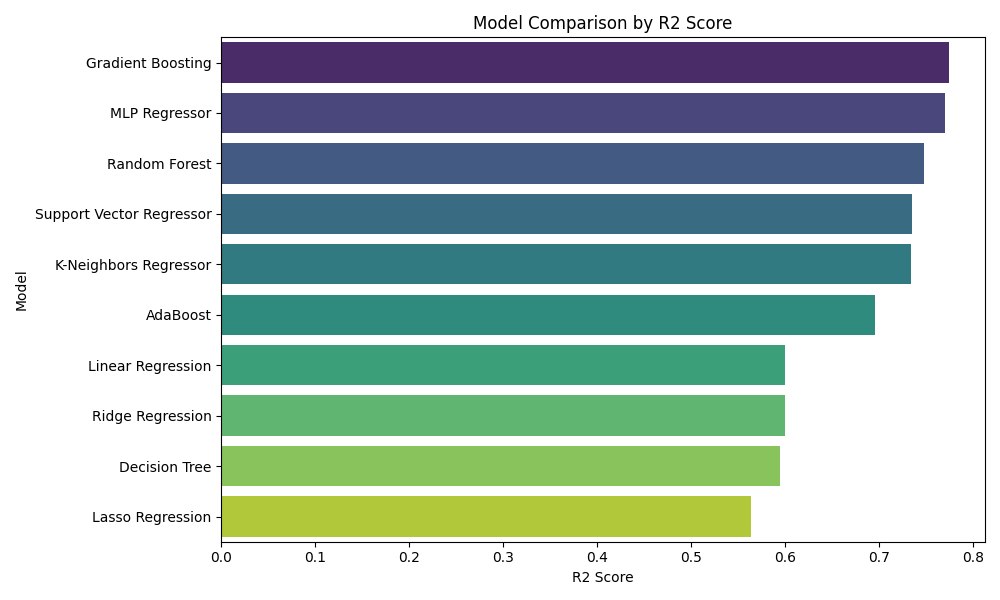

# Assignment 6: Synthetic Data Generation & Regression Model Benchmarking

## Overview

This project walks through generating synthetic data from a discrete-event simulation and using it to benchmark several machine learning regression models. The goal is to predict system wait times based on queue arrival and service parameters.

## Methodology

### 1. Simulation Setup

The simulation was built using **SimPy**, a process-based discrete-event simulation library for Python.

- **Scenario:** A classic single-server queue (M/M/1 model) — similar to a bank counter or a CPU scheduling queue.
- **Objective:** Predict the **Average Wait Time** experienced by customers based on the arrival and service rate inputs.

### 2. Parameters

Two key parameters were varied across simulation runs:

1. **Mean Interarrival Time** — the average gap between consecutive customer arrivals.
2. **Mean Service Time** — the average time required to process a single customer.

### 3. Data Generation

- A total of **1000 independent simulation runs** were executed.
- For each run, interarrival and service time values were sampled randomly.
- The **Average Wait Time** per run was recorded as the target variable for model training.

### 4. Machine Learning Models

The following ten regression algorithms were trained and evaluated on the generated dataset:

1. Linear Regression
2. Ridge Regression
3. Lasso Regression
4. K-Neighbors Regressor
5. Decision Tree Regressor
6. Random Forest Regressor
7. Gradient Boosting Regressor
8. AdaBoost Regressor
9. Support Vector Regressor (SVR)
10. MLP Regressor (Neural Network)

---

## Results

All models were evaluated using two metrics — **Mean Squared Error (MSE)** and **R² Score** (Coefficient of Determination). Lower MSE and higher R² both indicate better model performance.

### Model Comparison Table

| Model                    |     MSE |   R2 Score |
|:-------------------------|--------:|-----------:|
| Gradient Boosting        | 24.9443 |   0.774327 |
| MLP Regressor            | 25.3288 |   0.770848 |
| Random Forest            | 27.8013 |   0.748479 |
| Support Vector Regressor | 29.2376 |   0.735485 |
| K-Neighbors Regressor    | 29.3972 |   0.734041 |
| AdaBoost                 | 33.6504 |   0.695562 |
| Linear Regression        | 44.2097 |   0.600031 |
| Ridge Regression         | 44.2221 |   0.599918 |
| Decision Tree            | 44.8218 |   0.594494 |
| Lasso Regression         | 48.1997 |   0.563933 |

### Performance Visualization

Ensemble methods such as **Gradient Boosting** and **Random Forest** consistently outperform simpler models on this dataset. This is expected, as queue wait times exhibit non-linear dynamics that tree-based ensembles handle well.

---

## How to Run

1. Open `Assignment_6.ipynb` in Google Colab or Jupyter Notebook.
2. Run all cells sequentially to generate the simulation data and train the models.
3. Review the comparison table and bar chart for a visual summary of results.

