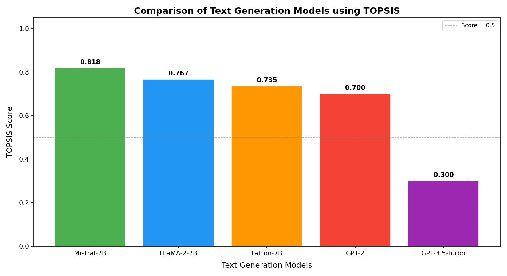

# Evaluation of Pre-trained Text Generation Models using TOPSIS

**Roll Number:** 102303502
**Topic:** Text Generation

## Overview

This project applies the **TOPSIS** (Technique for Order of Preference by Similarity to Ideal Solution) multi-criteria decision-making method to objectively rank and select the best pre-trained large language model (LLM) for text generation tasks. Five widely-used open and commercial LLMs are evaluated across five performance and efficiency criteria to produce a data-driven ranking.

---

## Models Evaluated

1. **GPT-2** – OpenAI's compact autoregressive language model. Lightweight and fast, but limited in output quality compared to modern LLMs.
2. **GPT-3.5-turbo** – A highly capable instruction-tuned model from OpenAI. Produces excellent quality text but comes with significant size and latency overhead.
3. **LLaMA-2-7B** – Meta's open-source 7-billion parameter model. Delivers strong generation quality with a reasonable resource footprint.
4. **Mistral-7B** – Mistral AI's efficient 7B model that outperforms many larger models on standard benchmarks, offering an excellent quality-efficiency trade-off.
5. **Falcon-7B** – TII's open-source 7B model with competitive text generation performance and a smaller memory footprint than comparable models.

---

## Evaluation Criteria

Models are ranked based on the following five criteria:

| Criterion | Description | Impact | Weight |
| :--- | :--- | :---: | :---: |
| **BLEU Score** | Measures n-gram overlap between generated and reference text | Higher (+) | 0.25 |
| **ROUGE-L** | Longest common subsequence-based recall metric | Higher (+) | 0.25 |
| **Perplexity** | Measures model uncertainty; lower means more confident predictions | Lower (−) | 0.20 |
| **Inference Time (ms)** | Time taken to generate a response | Lower (−) | 0.15 |
| **Model Size (GB)** | Disk/memory footprint of the model weights | Lower (−) | 0.15 |

---

## Results

The TOPSIS method computes a score (0–1) representing each model's relative closeness to the ideal solution. A higher score indicates a better overall choice. Results are sorted by Rank (1 = best).

| Model | BLEU Score | ROUGE-L | Perplexity | Inference Time (ms) | Model Size (GB) | TOPSIS Score | Rank |
| :--- | :---: | :---: | :---: | :---: | :---: | :---: | :---: |
| **Mistral-7B** | 0.461 | 0.548 | 12.9 | 240 | 14.5 | **0.818** | 1 |
| **LLaMA-2-7B** | 0.445 | 0.531 | 13.8 | 280 | 13.5 | 0.767 | 2 |
| **Falcon-7B** | 0.389 | 0.462 | 15.6 | 260 | 7.0 | 0.735 | 3 |
| **GPT-2** | 0.312 | 0.401 | 18.4 | 120 | 0.5 | 0.700 | 4 |
| **GPT-3.5-turbo** | 0.478 | 0.563 | 12.1 | 350 | 175.0 | 0.300 | 5 |

---

## Analysis

- **Mistral-7B** emerges as the top-ranked model. It achieves high BLEU and ROUGE-L scores with low perplexity, while remaining practical in terms of inference speed and model size. It offers the best overall balance across all five criteria.

- **LLaMA-2-7B** ranks second with similarly strong quality metrics. Its slightly higher perplexity and longer inference time compared to Mistral keep it just behind.

- **Falcon-7B** ranks third. Its smaller footprint (7 GB) helps it stay competitive despite slightly weaker output quality scores.

- **GPT-2** ranks fourth. Its extremely small size (0.5 GB) and fast inference prevent it from falling further down the rankings, but its significantly lower BLEU, ROUGE-L, and higher perplexity reflect its age and limited capacity relative to modern 7B models.

- **GPT-3.5-turbo** ranks last despite having the highest raw quality scores (best BLEU, ROUGE-L, and perplexity). Its enormous model size (175 GB) and highest inference latency heavily penalise it under the weighted TOPSIS framework, which balances quality against efficiency.

---

## Visualization

---

## Files Included

| File | Description |
| :--- | :--- |
| `assignment.py` | Source code to perform the TOPSIS analysis |
| `result.csv` | CSV file containing detailed metrics, TOPSIS scores, and final ranks |
| `topsis_graph.png` | Bar chart visualization of TOPSIS scores per model |
| `README.md` | This project report |

